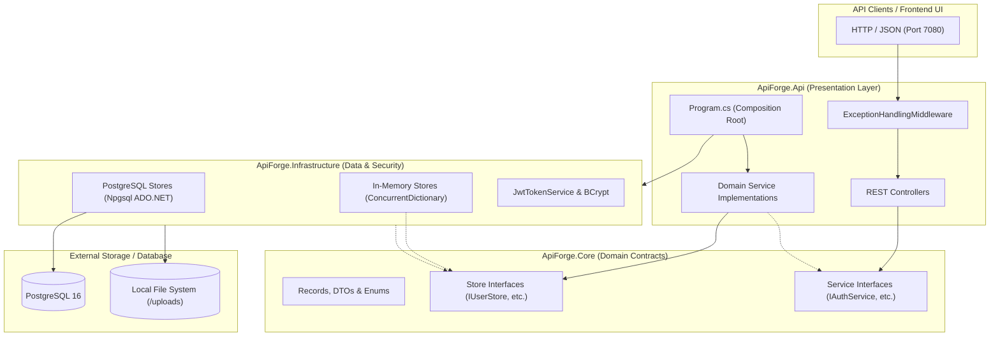
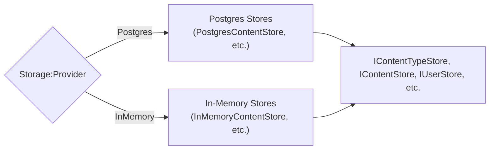
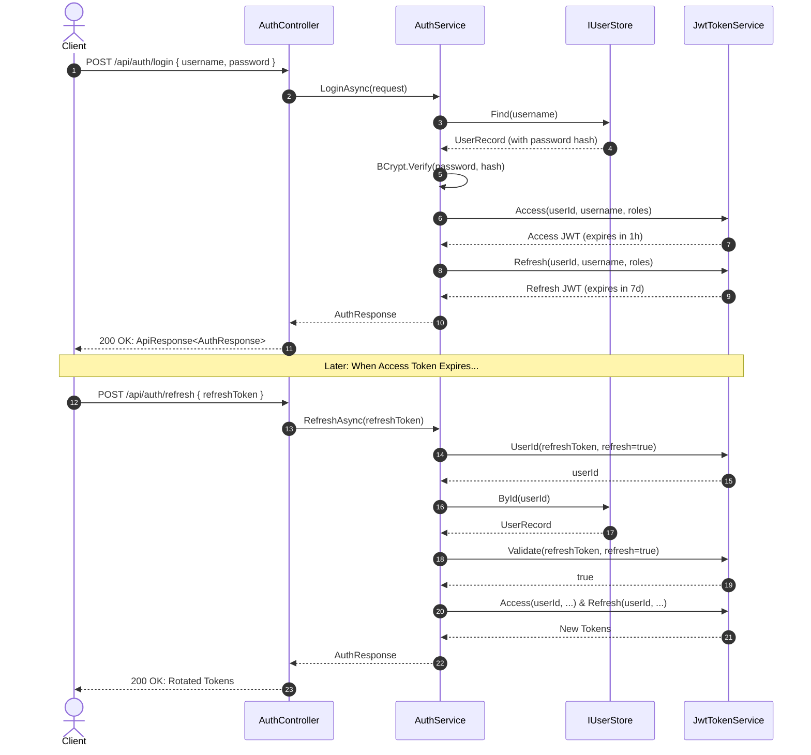
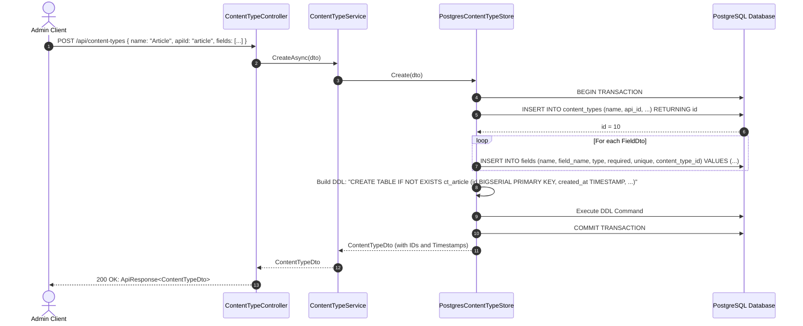
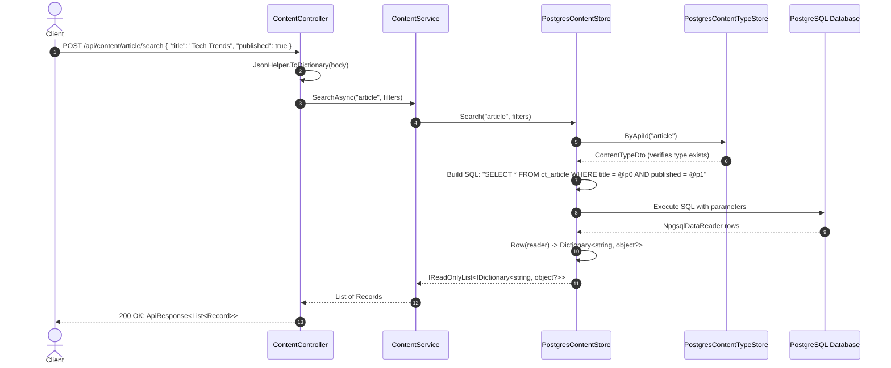
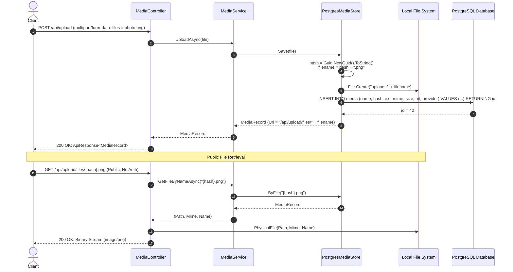
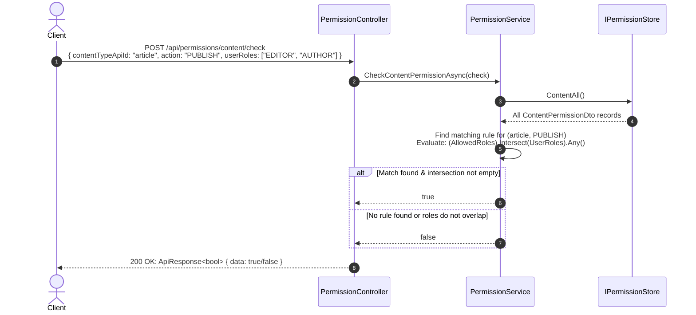
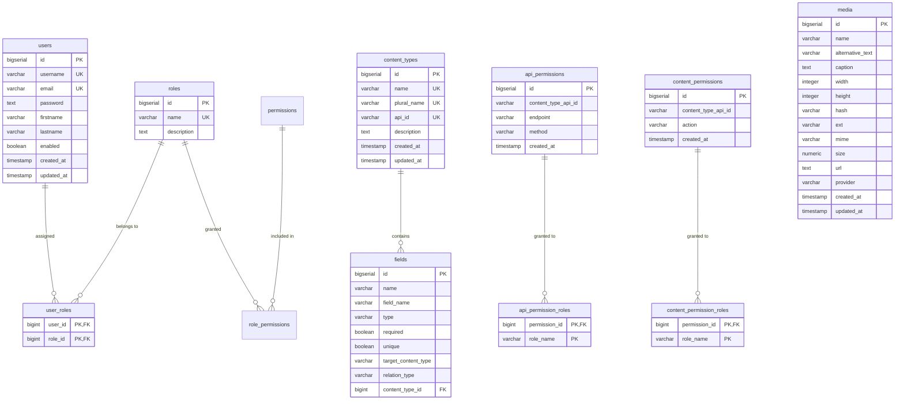

# ApiForge Headless CMS: Architecture, Codebase & API Guide
## Comprehensive Developer Onboarding to the ApiForge Project

Welcome to the **ApiForge Headless CMS** project! This document is the definitive deep-dive guide to the architecture, codebase organization, classes, interfaces, and end-to-end API request lifecycles of ApiForge.

Whether you are onboarding as a new contributor, extending the schema engine, or debugging production flows, this document will give you an exact mental model of how ApiForge operates under the hood.

---

## Table of Contents
1. [Project Overview & Core Capabilities](#1-project-overview--core-capabilities)
2. [System Architecture & Clean Architecture Boundaries](#2-system-architecture--clean-architecture-boundaries)
3. [The Pluggable Storage Pattern](#3-the-pluggable-storage-pattern)
4. [The Dynamic Schema Engine: How Runtime DDL Works](#4-the-dynamic-schema-engine-how-runtime-ddl-works)
5. [Complete Repository File Map](#5-complete-repository-file-map)
6. [Detailed Class, Record & Interface Reference](#6-detailed-class-record--interface-reference)
   - [6.1 ApiForge.Core (Domain Contracts & Interfaces)](#61-apiforgecore-domain-contracts--interfaces)
   - [6.2 ApiForge.Infrastructure (Data Adapters & Security)](#62-apiforgeinfrastructure-data-adapters--security)
   - [6.3 ApiForge.Api (Composition, Controllers & Services)](#63-apiforgeapi-composition-controllers--services)
7. [End-to-End API Lifecycles & Sequence Diagrams](#7-end-to-end-api-lifecycles--sequence-diagrams)
   - [7.1 Authentication & Token Refresh Flow](#71-authentication--token-refresh-flow)
   - [7.2 Content Type Creation & Dynamic Table DDL Flow](#72-content-type-creation--dynamic-table-ddl-flow)
   - [7.3 Dynamic Content CRUD & Multi-Field Search Flow](#73-dynamic-content-crud--multi-field-search-flow)
   - [7.4 Media Upload & Static Streaming Flow](#74-media-upload--static-streaming-flow)
   - [7.5 Permission Role-Intersection Evaluation Flow](#75-permission-role-intersection-evaluation-flow)
8. [Database Schema & Relational Architecture](#8-database-schema--relational-architecture)
9. [Error Handling & The Envelope Pattern](#9-error-handling--the-envelope-pattern)
10. [Configuration, Docker & Execution Guide](#10-configuration-docker--execution-guide)

---

## 1. Project Overview & Core Capabilities

**ApiForge** is a modern headless Content Management System (CMS) designed to provide instant, dynamic REST APIs for any content model created by users at runtime.

### Key Capabilities:
1. **Authentication & Identity**: User registration, login, role assignments, BCrypt password hashing, and dual-token JWT security (access + refresh tokens).
2. **Dynamic Content Modeling**: Users define arbitrary content types (e.g. `Articles`, `Products`, `Events`) with custom fields (`SHORT_TEXT`, `LONG_TEXT`, `RICH_TEXT`, `NUMBER`, `BOOLEAN`, `DATETIME`, `MEDIA`, `RELATION`).
3. **Runtime Schema Provisioning**: When a content type is created, ApiForge dynamically generates physical PostgreSQL tables (prefixed with `ct_`) and alters/drops them accordingly.
4. **Dynamic Content CRUD & Search**: Ingests arbitrary JSON payloads, maps them to dynamic tables or in-memory dictionaries, and provides exact-match multi-attribute `AND` search.
5. **Media Asset Management**: Multipart file uploads (`files`), disk-based storage with UUID hashes, metadata tracking, and public media streaming.
6. **Role-Based Permission Matrix**: Fine-grained access control on both HTTP endpoints and high-level content actions (`CREATE`, `READ`, `UPDATE`, `DELETE`, `PUBLISH`) using role-intersection algorithms.

---

## 2. System Architecture & Clean Architecture Boundaries

ApiForge is structured according to **Clean Architecture** principles. Dependencies flow inward toward the core domain abstractions:



### Architectural Layers:

1. **`ApiForge.Core`**:
   * Contains **pure C# contracts** (Records, DTOs, Enums).
   * Defines all persistence repository interfaces (`IUserStore`, `IContentTypeStore`, `IContentStore`, `IPermissionStore`, `IMediaStore`).
   * Defines domain service interfaces (`IAuthService`, `IContentService`, etc.).
   * **Zero dependencies** on databases, external ORMs, or ASP.NET Core internals (except basic framework annotations like `[property: JsonIgnore]`).

2. **`ApiForge.Infrastructure`**:
   * Implements the persistence interfaces defined in `Core`.
   * Implements security operations (JWT creation/validation via `System.IdentityModel.Tokens.Jwt` and BCrypt password hashing).
   * Encapsulates low-level database operations using PostgreSQL raw ADO.NET (`NpgsqlConnection`, `NpgsqlCommand`).

3. **`ApiForge.Api`**:
   * Acts as the application's composition root (`Program.cs`).
   * Houses the REST controllers (`AuthController`, `ContentController`, etc.).
   * Implements application-level orchestration services.
   * Configures ASP.NET Core middleware (CORS, JWT Authentication, Swagger, Exception Handling).

---

## 3. The Pluggable Storage Pattern

ApiForge features a pluggable storage strategy controlled entirely through configuration:

```csharp
// Program.cs
var isPostgres = builder.Configuration["Storage:Provider"]?.Equals("Postgres", StringComparison.OrdinalIgnoreCase) == true;
```



| Feature | `InMemory` Provider | `Postgres` Provider |
|---|---|---|
| **Primary Use Case** | Unit testing, rapid local development, CI pipelines | Staging, production, persistent deployments |
| **Backing Engine** | `ConcurrentDictionary<TKey, TValue>` & `Interlocked` | PostgreSQL 16 via `Npgsql` ADO.NET |
| **Dependencies** | None (pure in-memory C# collections) | PostgreSQL database server |
| **Data Durability** | Non-persistent (resets upon app restart) | Full ACID persistence with transaction support |
| **Table Creation** | Keyed dictionary namespaces | Real physical SQL tables (`ct_{apiId}`) |

---

## 4. The Dynamic Schema Engine: How Runtime DDL Works

The defining feature of a headless CMS is allowing users to design data models on the fly. When a client calls `POST /api/content-types`, ApiForge converts metadata into a physical database schema:

### Field Type Mapping Table:

| ApiForge `FieldType` | PostgreSQL Column Type | SQL Constraints Generated |
|---|---|---|
| `SHORT_TEXT` | `VARCHAR(255)` | `NOT NULL` (if required), `UNIQUE` (if unique) |
| `LONG_TEXT` | `TEXT` | `NOT NULL`, `UNIQUE` |
| `RICH_TEXT` | `TEXT` | `NOT NULL`, `UNIQUE` |
| `NUMBER` | `NUMERIC` | `NOT NULL`, `UNIQUE` |
| `BOOLEAN` | `BOOLEAN` | `NOT NULL`, `UNIQUE` |
| `DATETIME` | `TIMESTAMP` | `NOT NULL`, `UNIQUE` |
| `MEDIA` | `BIGINT` (references `media.id`) | `NOT NULL`, `UNIQUE` |
| `RELATION` | `BIGINT` (references foreign content) | `NOT NULL`, `UNIQUE` |

### DDL Generation Mechanism (`PostgresStores.cs`):
```csharp
private static string FieldSql(FieldDto f)
{
    var type = f.Type switch
    {
        FieldType.SHORT_TEXT => "VARCHAR(255)",
        FieldType.LONG_TEXT or FieldType.RICH_TEXT => "TEXT",
        FieldType.NUMBER => "NUMERIC",
        FieldType.BOOLEAN => "BOOLEAN",
        FieldType.DATETIME => "TIMESTAMP",
        FieldType.MEDIA or FieldType.RELATION => "BIGINT",
        _ => "TEXT"
    };
    return $"{Safe(f.FieldName)} {type}{(f.Required == true ? " NOT NULL" : "")}{(f.Unique == true ? " UNIQUE" : "")}";
}
```

When `IContentTypeStore.Create` executes:
1. It inserts the content type definition into the `content_types` table.
2. It inserts each field definition into the `fields` table with a foreign key back to `content_types.id`.
3. It executes a physical `CREATE TABLE`:
   ```sql
   CREATE TABLE IF NOT EXISTS ct_{apiId} (
       id BIGSERIAL PRIMARY KEY,
       created_at TIMESTAMP DEFAULT CURRENT_TIMESTAMP,
       updated_at TIMESTAMP DEFAULT CURRENT_TIMESTAMP,
       {dynamic_columns...}
   );
   ```
4. When a content type is deleted, it executes:
   ```sql
   DROP TABLE IF EXISTS ct_{apiId};
   DELETE FROM content_types WHERE id = @id;
   ```

### SQL Injection Prevention:
Because table names and column names cannot be passed as SQL parameters in PostgreSQL (`@param`), ApiForge enforces strict identifier validation via the `Safe()` function:
```csharp
private static string Safe(string value)
{
    if (string.IsNullOrWhiteSpace(value) || value.Any(c => !(char.IsLetterOrDigit(c) || c == '_')))
        throw new ApiForgeException("Invalid identifier", 400);
    return value;
}
```

---

## 5. Complete Repository File Map

```text
apiforge-headless-cms-dotnet/
│
├── ApiForge.HeadlessCms.sln
│   └── Visual Studio / MSBuild Solution file aggregating all 5 projects.
│
├── Directory.Build.props
│   └── Global MSBuild configuration: net10.0, nullable enabled, treat warnings as errors.
│
├── Dockerfile
│   └── Multi-stage container build targeting mcr.microsoft.com/dotnet/aspnet:10.0.
│
├── docker-compose.yml
│   └── Orchestrates Postgres 16 container and the ApiForge.Api service on port 7080.
│
├── db/
│   ├── 00_ddl.sql
│   │   └── DDL script initializing users, roles, permissions, content_types, fields, and media tables.
│   └── 01_seed_auth.sql
│       └── Seed data initializing default roles (SUPER_ADMIN, ADMIN, etc.) and admin user accounts.
│
├── src/
│   ├── ApiForge.Core/
│   │   ├── ApiForge.Core.csproj
│   │   │   └── Project file referencing Microsoft.AspNetCore.App framework for web primitives.
│   │   ├── Common/
│   │   │   └── ApiResponse.cs: Universal JSON response envelope.
│   │   ├── Enums/
│   │   │   └── FieldType.cs: Supported field types enum.
│   │   ├── Models/
│   │   │   ├── UserRecord.cs: Internal user domain model.
│   │   │   └── MediaRecord.cs: Media asset metadata domain model.
│   │   ├── DTOs/
│   │   │   ├── AuthDtos.cs: RegisterRequest, LoginRequest, AuthResponse, UserDto, etc.
│   │   │   ├── ContentTypeDtos.cs: ContentTypeDto and FieldDto.
│   │   │   └── PermissionDtos.cs: ApiPermissionDto, ContentPermissionDto, PermissionCheck.
│   │   ├── Stores/
│   │   │   ├── IUserStore.cs
│   │   │   ├── IContentTypeStore.cs
│   │   │   ├── IContentStore.cs
│   │   │   ├── IMediaStore.cs
│   │   │   └── IPermissionStore.cs
│   │   └── Services/
│   │       ├── IAuthService.cs
│   │       ├── IUserService.cs
│   │       ├── IContentTypeService.cs
│   │       ├── IContentService.cs
│   │       ├── IMediaService.cs
│   │       └── IPermissionService.cs
│   │
│   ├── ApiForge.Infrastructure/
│   │   ├── ApiForge.Infrastructure.csproj
│   │   │   └── References Npgsql, BCrypt.Net-Next, and System.IdentityModel.Tokens.Jwt.
│   │   ├── Security.cs
│   │   │   └── JwtTokenService: HS256 JWT access and refresh token generation/validation.
│   │   ├── InMemoryStores.cs
│   │   │   └── ApiForgeException + ConcurrentDictionary implementations of all store interfaces.
│   │   ├── PostgresStores.cs
│   │   │   └── PostgresContentTypeStore (DDL generator) + PostgresContentStore (dynamic CRUD).
│   │   ├── PostgresIdentityStores.cs
│   │   │   └── PostgresUserStore + PostgresPermissionStore (raw Npgsql ADO.NET implementations).
│   │   ├── MediaStore.cs
│   │   │   └── In-memory media metadata store + local disk file writer.
│   │   └── PostgresMediaStore.cs
│   │       └── PostgreSQL media metadata store + local disk file writer.
│   │
│   └── ApiForge.Api/
│       ├── ApiForge.Api.csproj
│       │   └── Web SDK project referencing JwtBearer, Swashbuckle, and BCrypt.
│       ├── Program.cs
│       │   └── Main entry point, DI container setup, JWT configuration, middleware pipeline.
│       ├── appsettings.json
│       │   └── Base configuration (Postgres connection string, JWT secret keys).
│       ├── appsettings.Development.json
│       │   └── Local development overrides (sets Storage:Provider to InMemory).
│       ├── Helpers/
│       │   └── JsonHelper.cs: Unpacks dynamic JsonElement into IDictionary<string, object?>.
│       ├── Middleware/
│       │   └── ExceptionHandlingMiddleware.cs: Intercepts exceptions, translates SQL states.
│       ├── Services/
│       │   ├── AuthService.cs: Register, login, token refresh, validation logic.
│       │   ├── UserService.cs: User retrieval, role assignment, deletion logic.
│       │   ├── ContentTypeService.cs: Content type orchestration.
│       │   ├── ContentService.cs: Dynamic content CRUD and exact-match search orchestration.
│       │   ├── MediaService.cs: File upload, metadata lookup, and streaming orchestration.
│       │   └── PermissionService.cs: API and Content permission CRUD & role-intersection checks.
│       └── Controllers/
│           ├── AuthController.cs: /api/auth/* endpoints.
│           ├── ContentTypeController.cs: /api/content-types/* endpoints.
│           ├── ContentController.cs: /api/content/* endpoints.
│           ├── MediaController.cs: /api/upload/* endpoints.
│           └── PermissionController.cs: /api/permissions/* endpoints.
│
└── tests/
    ├── ApiForge.UnitTests/
    │   ├── ApiForge.UnitTests.csproj
    │   ├── Usings.cs
    │   └── StoreTests.cs: Unit tests verifying pluralization, search logic, and BCrypt hashing.
    └── ApiForge.ApiTests/
        ├── ApiForge.ApiTests.csproj
        ├── Usings.cs
        └── ApiTests.cs: Full-stack integration tests using WebApplicationFactory<Program>.
```

---

## 6. Detailed Class, Record & Interface Reference

### 6.1 ApiForge.Core (Domain Contracts & Interfaces)

#### Common & Enums
* [`ApiResponse<T>`](file:///c:/Users/dhrubo/projects/apiforge-headless-cms-dotnet/src/ApiForge.Core/Common/ApiResponse.cs): Universal response envelope `(bool Success, string? Message, T? Data, string? Error)`.
* [`FieldType`](file:///c:/Users/dhrubo/projects/apiforge-headless-cms-dotnet/src/ApiForge.Core/Enums/FieldType.cs): Enum of supported field types: `SHORT_TEXT`, `LONG_TEXT`, `RICH_TEXT`, `NUMBER`, `BOOLEAN`, `DATETIME`, `MEDIA`, `RELATION`.

#### Domain Models ([`src/ApiForge.Core/Models/`](file:///c:/Users/dhrubo/projects/apiforge-headless-cms-dotnet/src/ApiForge.Core/Models))
* [`UserRecord`](file:///c:/Users/dhrubo/projects/apiforge-headless-cms-dotnet/src/ApiForge.Core/Models/UserRecord.cs): Internal entity holding the BCrypt password hash and mutable role list.
* [`MediaRecord`](file:///c:/Users/dhrubo/projects/apiforge-headless-cms-dotnet/src/ApiForge.Core/Models/MediaRecord.cs): File metadata record: `(Id, Name, AlternativeText, Caption, Width, Height, Hash, Ext, Mime, Size, Url, Provider, Path)`. Note that `Path` is marked `[property: JsonIgnore]` so absolute server paths are never leaked over HTTP.

#### Data Transfer Objects ([`src/ApiForge.Core/DTOs/`](file:///c:/Users/dhrubo/projects/apiforge-headless-cms-dotnet/src/ApiForge.Core/DTOs))
* [`AuthDtos.cs`](file:///c:/Users/dhrubo/projects/apiforge-headless-cms-dotnet/src/ApiForge.Core/DTOs/AuthDtos.cs): Contains `AuthResponse`, `RegisterRequest`, `LoginRequest`, `RefreshRequest`, and `UserDto`.
* [`ContentTypeDtos.cs`](file:///c:/Users/dhrubo/projects/apiforge-headless-cms-dotnet/src/ApiForge.Core/DTOs/ContentTypeDtos.cs): Contains `ContentTypeDto` and `FieldDto`.
* [`PermissionDtos.cs`](file:///c:/Users/dhrubo/projects/apiforge-headless-cms-dotnet/src/ApiForge.Core/DTOs/PermissionDtos.cs): Contains `ApiPermissionDto`, `ContentPermissionDto`, and `PermissionCheck`.

#### Store Interfaces ([`src/ApiForge.Core/Stores/`](file:///c:/Users/dhrubo/projects/apiforge-headless-cms-dotnet/src/ApiForge.Core/Stores))
* [`IUserStore`](file:///c:/Users/dhrubo/projects/apiforge-headless-cms-dotnet/src/ApiForge.Core/Stores/IUserStore.cs): `Find(identifier)`, `ById(id)`, `All()`, `Add(...)`, `SetRoles(id, roles)`, `Remove(id)`.
* [`IContentTypeStore`](file:///c:/Users/dhrubo/projects/apiforge-headless-cms-dotnet/src/ApiForge.Core/Stores/IContentTypeStore.cs): `All()`, `ById(id)`, `ByApiId(apiId)`, `Create(dto)`, `Update(id, dto)`, `Delete(id)`.
* [`IContentStore`](file:///c:/Users/dhrubo/projects/apiforge-headless-cms-dotnet/src/ApiForge.Core/Stores/IContentStore.cs): `Create(apiId, values)`, `All(apiId)`, `Search(apiId, filters)`, `ById(apiId, id)`, `Update(apiId, id, values)`, `Delete(apiId, id)`.
* [`IPermissionStore`](file:///c:/Users/dhrubo/projects/apiforge-headless-cms-dotnet/src/ApiForge.Core/Stores/IPermissionStore.cs): Full CRUD for both API permissions and Content permissions.
* [`IMediaStore`](file:///c:/Users/dhrubo/projects/apiforge-headless-cms-dotnet/src/ApiForge.Core/Stores/IMediaStore.cs): `Save(file)`, `All()`, `ById(id)`, `ByFile(filename)`, `Remove(id)`.

---

### 6.2 ApiForge.Infrastructure (Data Adapters & Security)

#### [`ApiForgeException`](file:///c:/Users/dhrubo/projects/apiforge-headless-cms-dotnet/src/ApiForge.Infrastructure/InMemoryStores.cs#L7)
```csharp
public sealed class ApiForgeException(string message, int status) : Exception(message) 
{ 
    public int Status { get; } = status; 
}
```
Custom exception class carrying an explicit HTTP status code (`400`, `401`, `403`, `404`, `409`, `500`). When thrown anywhere in the business or data layer, `ExceptionHandlingMiddleware` extracts `ex.Status` and formats an `ApiResponse.Fail(ex.Message)`.

#### [`JwtTokenService`](file:///c:/Users/dhrubo/projects/apiforge-headless-cms-dotnet/src/ApiForge.Infrastructure/Security.cs#L9-L29)
Responsible for token cryptographic operations:
* `Access(id, username, roles)`: Generates an HS256-signed JWT valid for **1 hour**, containing claims: `sub`, `userId`, `username`, and multiple `role` claims.
* `Refresh(id, username, roles)`: Generates a JWT using `Jwt:RefreshSecret` valid for **7 days**.
* `Validate(token, refresh = false)`: Performs strict signature and expiration validation (`ClockSkew = TimeSpan.Zero`).
* `UserId(token, refresh = false)`: Extracts the `userId` claim from a valid token.

#### In-Memory Stores ([`InMemoryStores.cs`](file:///c:/Users/dhrubo/projects/apiforge-headless-cms-dotnet/src/ApiForge.Infrastructure/InMemoryStores.cs))
* `InMemoryContentTypeStore`: Stores `ContentTypeDto` records in a `ConcurrentDictionary<long, ContentTypeDto>`. Generates IDs using `Interlocked.Increment`. Automatically populates `PluralName` (defaults to `Name + "s"`) and generates random IDs for fields if not provided.
* `InMemoryContentStore`: Stores dynamic records in a nested dictionary: `ConcurrentDictionary<string, ConcurrentDictionary<long, IDictionary<string, object?>>>`. Implements exact `AND` search by evaluating:
  ```csharp
  rows.Where(row => filters.All(f => row.TryGetValue(f.Key, out var v) && string.Equals(Convert.ToString(v), Convert.ToString(f.Value), StringComparison.OrdinalIgnoreCase)))
  ```
* `InMemoryUserStore`: Pre-seeded with an administrator account (`admin` / `password123` with roles `SUPER_ADMIN` and `ADMIN`). Stores users in `ConcurrentDictionary<long, UserRecord>`.
* `InMemoryPermissionStore`: Stores `ApiPermissionDto` and `ContentPermissionDto` in concurrent collections.

#### PostgreSQL Stores ([`PostgresStores.cs`](file:///c:/Users/dhrubo/projects/apiforge-headless-cms-dotnet/src/ApiForge.Infrastructure/PostgresStores.cs), [`PostgresIdentityStores.cs`](file:///c:/Users/dhrubo/projects/apiforge-headless-cms-dotnet/src/ApiForge.Infrastructure/PostgresIdentityStores.cs))
* `PostgresContentTypeStore`: Coordinates DDL execution and metadata storage. Runs inside a database transaction (`BeginTransactionAsync`) to ensure that metadata records in `content_types` and `fields` are committed atomically with the physical `CREATE TABLE ct_{apiId}`.
* `PostgresContentStore`: Performs dynamic queries against `ct_{apiId}` tables:
  * Dynamic INSERT: Extracts keys from the incoming dictionary, validates each via `Safe()`, creates parameterized placeholders (`@p0, @p1, ...`), and appends `RETURNING *`.
  * Dynamic SEARCH: Builds a parameterized `WHERE key1 = @p0 AND key2 = @p1` query.
* `PostgresUserStore`: Queries the `users`, `roles`, and `user_roles` tables. Uses PostgreSQL's `array_agg(r.name)` to aggregate roles into a string array in a single query.
* `PostgresPermissionStore`: Manages permission records and their associated role bridge tables (`api_permission_roles`, `content_permission_roles`).

#### Media Stores ([`MediaStore.cs`](file:///c:/Users/dhrubo/projects/apiforge-headless-cms-dotnet/src/ApiForge.Infrastructure/MediaStore.cs), [`PostgresMediaStore.cs`](file:///c:/Users/dhrubo/projects/apiforge-headless-cms-dotnet/src/ApiForge.Infrastructure/PostgresMediaStore.cs))
* When a file is uploaded, a unique GUID hash is generated: `hash = Guid.NewGuid().ToString()`.
* The physical file is written to `uploads/{hash}{ext}` on the host file system.
* Metadata is recorded with:
  * Size in KB (`file.Length / 1024d`).
  * Direct URL: `"/api/upload/files/" + hash + ext`.
  * Provider: `"local"`.
* When deleted, the record is removed and `File.Delete(path)` purges the physical file.

---

### 6.3 ApiForge.Api (Composition, Controllers & Services)

#### [`ExceptionHandlingMiddleware.cs`](file:///c:/Users/dhrubo/projects/apiforge-headless-cms-dotnet/src/ApiForge.Api/Middleware/ExceptionHandlingMiddleware.cs)
Centralized pipeline interceptor:
```csharp
public async Task InvokeAsync(HttpContext context)
{
    try
    {
        await next(context);
    }
    catch (ApiForgeException ex)
    {
        context.Response.StatusCode = ex.Status;
        context.Response.ContentType = "application/json";
        await context.Response.WriteAsJsonAsync(ApiResponse<object>.Fail(ex.Message));
    }
    catch (Exception ex)
    {
        logger.LogError(ex, "Unhandled exception occurred");
        var state = ex.GetType().GetProperty("SqlState")?.GetValue(ex)?.ToString();
        context.Response.StatusCode = state == "23505" ? 409 : 500;
        context.Response.ContentType = "application/json";
        var message = state == "23505" ? "Resource already exists" : $"Internal server error: {ex.Message}";
        await context.Response.WriteAsJsonAsync(ApiResponse<object>.Fail(message));
    }
}
```
* Translates PostgreSQL error `23505` (unique constraint violation) into HTTP 409 Conflict.
* Formats any unhandled exception into a standard `ApiResponse<object>.Fail(...)` envelope.

#### [`JsonHelper.cs`](file:///c:/Users/dhrubo/projects/apiforge-headless-cms-dotnet/src/ApiForge.Api/Helpers/JsonHelper.cs)
Utility for parsing dynamic payloads without compile-time schemas:
* `ToDictionary(JsonElement json)`: Enumerates all JSON object properties into a case-insensitive dictionary.
* `JsonElementValue(JsonElement x)`: Recursively extracts primitive types (`string`, `long`, `double`, `bool`, `null`, or raw JSON string).

#### Controllers
* [`AuthController`](file:///c:/Users/dhrubo/projects/apiforge-headless-cms-dotnet/src/ApiForge.Api/Controllers/AuthController.cs):
  * `POST /api/auth/register` `[AllowAnonymous]`: Creates user with default `REGISTERED` role.
  * `POST /api/auth/login` `[AllowAnonymous]`: Validates credentials, verifies `user.Enabled`, issues tokens.
  * `POST /api/auth/validate` `[AllowAnonymous]`: Validates token signature/expiry.
  * `POST /api/auth/refresh` `[AllowAnonymous]`: Validates refresh token, rotates tokens.
  * `GET /api/auth/users` `[Authorize]`: Lists all users.
  * `GET /api/auth/users/{id}` `[Authorize]`: Gets single user.
  * `PUT /api/auth/users/{id}/roles` `[Authorize]`: Assigns new roles to a user.
  * `DELETE /api/auth/users/{id}` `[Authorize]`: Deletes a user.
* [`ContentTypeController`](file:///c:/Users/dhrubo/projects/apiforge-headless-cms-dotnet/src/ApiForge.Api/Controllers/ContentTypeController.cs):
  * `POST /api/content-types`: Creates schema definition & dynamic table.
  * `GET /api/content-types`: Lists all registered content types.
  * `GET /api/content-types/{id}`: Retrieves content type by numeric ID.
  * `GET /api/content-types/api-id/{apiId}`: Retrieves content type by string API identifier.
  * `PUT /api/content-types/{id}`: Updates name, description, fields.
  * `DELETE /api/content-types/{id}`: Drops physical dynamic table & deletes metadata.
* [`ContentController`](file:///c:/Users/dhrubo/projects/apiforge-headless-cms-dotnet/src/ApiForge.Api/Controllers/ContentController.cs):
  * `POST /api/content/{apiId}`: Inserts dynamic record into `ct_{apiId}`.
  * `GET /api/content/{apiId}`: Lists all records in `ct_{apiId}`.
  * `POST /api/content/{apiId}/search`: Exact `AND` multi-field search against `ct_{apiId}`.
  * `GET /api/content/{apiId}/{id}`: Retrieves dynamic record by ID.
  * `PUT /api/content/{apiId}/{id}`: Updates fields on dynamic record.
  * `DELETE /api/content/{apiId}/{id}`: Deletes dynamic record.
* [`MediaController`](file:///c:/Users/dhrubo/projects/apiforge-headless-cms-dotnet/src/ApiForge.Api/Controllers/MediaController.cs):
  * `POST /api/upload`: Multipart file upload (`[FromForm(Name = "files")]`).
  * `GET /api/upload`: Lists all media metadata.
  * `GET /api/upload/{id}`: Retrieves metadata for single media item.
  * `DELETE /api/upload/{id}`: Deletes file from disk and deletes metadata.
  * `GET /api/upload/files/{fileName}` `[AllowAnonymous]`: Public physical file download via `PhysicalFile(path, mime, name)`.
* [`PermissionController`](file:///c:/Users/dhrubo/projects/apiforge-headless-cms-dotnet/src/ApiForge.Api/Controllers/PermissionController.cs):
  * Full CRUD for API endpoint permissions (`/api/permissions/api/*`).
  * Full CRUD for Content action permissions (`/api/permissions/content/*`).
  * `POST /api/permissions/api/check`: Evaluates if user's roles have access to an endpoint/method.
  * `POST /api/permissions/content/check`: Evaluates if user's roles have access to a content action.

---

## 7. End-to-End API Lifecycles & Sequence Diagrams

### 7.1 Authentication & Token Refresh Flow



---

### 7.2 Content Type Creation & Dynamic Table DDL Flow



---

### 7.3 Dynamic Content CRUD & Multi-Field Search Flow



---

### 7.4 Media Upload & Static Streaming Flow



---

### 7.5 Permission Role-Intersection Evaluation Flow



---

## 8. Database Schema & Relational Architecture

The static schema (defined in [`db/00_ddl.sql`](file:///c:/Users/dhrubo/projects/apiforge-headless-cms-dotnet/db/00_ddl.sql)) manages authentication, metadata, media, and authorization:



In addition to the static tables above, ApiForge creates **dynamic content tables** named `ct_{api_id}` (e.g. `ct_article`, `ct_product`) at runtime whenever a new content type is registered.

---

## 9. Error Handling & The Envelope Pattern

ApiForge strictly guarantees that **every API response**—whether HTTP 200, 400, 401, 404, 409, or 500—is wrapped in the exact same JSON envelope format:

### Success Response:
```json
{
  "success": true,
  "message": "User registered successfully",
  "data": {
    "token": "eyJhbGciOiJIUzI1Ni...",
    "refreshToken": "eyJhbGciOiJIUzI1Ni...",
    "type": "Bearer",
    "userId": 1,
    "username": "admin",
    "email": "admin@apiforge.com",
    "roles": ["SUPER_ADMIN", "ADMIN"]
  },
  "error": null
}
```

### Error Response (e.g., 404 Not Found):
```json
{
  "success": false,
  "message": null,
  "data": null,
  "error": "Content type not found"
}
```

### Error Response (e.g., 401 Unauthorized via JWT Challenge):
```json
{
  "success": false,
  "message": null,
  "data": null,
  "error": "Unauthorized"
}
```

### Error Response (e.g., 409 Conflict via PostgreSQL Unique Violation):
```json
{
  "success": false,
  "message": null,
  "data": null,
  "error": "Resource already exists"
}
```

---

## 10. Configuration, Docker & Execution Guide

### Running in Local In-Memory Mode:
Requires .NET 10 SDK. In-memory mode requires zero external dependencies:
```powershell
# In PowerShell:
$env:ASPNETCORE_ENVIRONMENT="Development"
dotnet run --project src/ApiForge.Api --urls http://localhost:7080
```
Swagger UI will be available at: `http://localhost:7080/swagger`

### Running with Docker Compose (PostgreSQL 16):
Spins up a PostgreSQL 16 container, executes `00_ddl.sql` and `01_seed_auth.sql`, builds the .NET 10 container, mounts persistent volumes for uploads and pgdata, and exposes the app on port 7080:
```bash
docker compose up --build
```

### Running Test Suites:
```bash
# Run all unit and integration tests:
dotnet test ApiForge.HeadlessCms.sln --configuration Release

# Run only store unit tests:
dotnet test tests/ApiForge.UnitTests

# Run full WebApplicationFactory integration tests:
dotnet test tests/ApiForge.ApiTests
```

### Pre-Seeded Administrative Credentials:
When using `01_seed_auth.sql` or the default `InMemoryUserStore`:
* **Username**: `admin` (or `super_admin`)
* **Password**: `password123`
* **Roles**: `["SUPER_ADMIN", "ADMIN"]`

---

## Summary

ApiForge delivers an enterprise-grade headless CMS architecture:
1. **Separation of Concerns**: Pure domain contracts in `ApiForge.Core`, swappable data adapters in `ApiForge.Infrastructure`, and HTTP composition in `ApiForge.Api`.
2. **Pluggable Storage**: Instant zero-dependency in-memory execution alongside high-throughput PostgreSQL dynamic table provisioning.
3. **Robust Security**: Dual-token JWT authentication, BCrypt hashing, and role-intersection authorization.
4. **Predictable Contracts**: 100% uniform `ApiResponse<T>` envelopes across all success and error execution paths.
